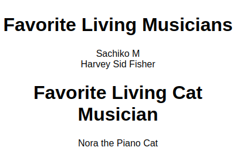

# Learn React

A brief description of what this project does and who it's for

## Intro to JSX

+ Why React ?
    + fast,modular,scalable,flexible,popular
+ What is JSX ? 
    + syntax extension for JS
    + jsx -> javascript (converted by jsx compiler in web browser)
+ Virtual DOM :
    + DOM manipulation is much slower.
    + jo apadi pase 10list hoy ema navu nakhavu hoy to khali ek j recreate karavu pade mote bhage 11list banave je bau expensive hoy chhe.
    + Virtual DOM is rep of a DOM object like a lightweight copy.
    + Virtual DOM manipulation is faster than DOM manipulation
    + tunk ma je changes thay e virtual dom ma thay paachhi ene accordingly etala j changes DOM ma thay.

+ `class` v/s `className` 
    + In HTML `<h1 class="big">Title</h1>`
    + In JSX `<h1 className="big">Title</h1>`

+ Self closing Tags:
    + HTML ma `` ✅ ,`` ✅
    + JSX ma `` ✅

+ `{}` in JSX :
    + `{JS}` inside JSX (jsx ni ander js lakhava mate {} use thay chhe)

+ Eventlisteners :
    + In HTML : onclick or onmouseover
    + In JSX : onClick or onMouseOver

+ `if` in JSX will not work:
    + Use Ternary Operator:`{ condn ? truth : false}` 
```javascript
function coinToss () {
    // Randomly return either 'heads' or 'tails'.
    return Math.random() < 0.5 ? 'heads' : 'tails';
}

const pics = {
  kitty: 'https://content.codecademy.com/courses/React/react_photo-kitty.jpg',
  doggy: 'https://content.codecademy.com/courses/React/react_photo-puppy.jpeg'
};

const img = ;

```
+ Code example 2:

```javascript
// This is fine in JSX, not in an explicit array:
<ul>
  <li>item 1</li>
  <li>item 2</li>
  <li>item 3</li>
</ul>

// This is also fine!
const liArray = [
  <li>item 1</li>, 
  <li>item 2</li>, 
  <li>item 3</li>
];

<ul>{liArray}</ul>
```

+ `key` in JSX:
    + list <li> hoy ema use thay.
    + `key`'s value should be unique
    + similar to `id` attribute
    + key apavi good practice chhe 

+ `React.createElement`
    + react code without jsx
        + JSX expression : 
        ```javascript
        const h1 = <h1>Hello world</h1>;
        ```
        + can be rewritten without JSX, like this:
        ```javascript
        const h1 =  React.createElement(
                        "h1",
                        null,
                        "Hello world"
                    );

        ```
        + When a JSX element is compiled, the compiler transforms the JSX element into the method that you see above: `React.createElement()`. Every JSX element is secretly a call to `React.createElement()`.

## React Component :

+ Component : 
    + Functional Component : JS Function (Nam nu starting capital letter thi thay)(UpperCamelCase)
    + Nested pan kari sakay chhe.
    + Function components must return some React elements in JSX syntax.
    + React components can be exported and imported from file to file.


## COMPONENTS RENDER OTHER COMPONENTS:

+  Components interact with each other by passing information or even returning other components.

    ```javascript
    import Button from './Button'

    function App() {
      return <Button />;
    }

    export default App;
    ```

+ Components interacting allows them to be broken into smaller components, stored into separate files, and reused when necessary.

    ```javascript
    //HelloWorld.js
    import React from 'react';

    function HelloWorld(){
        return(
            <h1>Hello World!</h1>
        );
    };

    export default HelloWorld;

    //App.js
    import React from 'react';
    import HelloWorld from './HelloWorld';

    function App(){
        return(
            <HelloWorld />
        );
    };

    export default App;

    //index.js
    import React from 'react';
    import ReactDOM from 'react-dom';
    import App from './App';

    ReactDOM.createRoot(document.getElementById('app')).render(<App />);
    ```

+ Props:
    + Information that gets passed from one component to another is known as props.

    + Props serve the same purpose for components as arguments do for functions.

    + Passing Props:
    ```javascript

    // For string
    <SloganDisplay message="We're great!" />

    // No String then  wrap that information in curly braces
    <Greeting myInfo={["Astronaut", "Narek", "43"]} />

    ```

    + Displaying Props:
    ```javascript
    //App.js
    import React from 'react';
    import Product from './Product'

    function App() {
        return <Product name="Apple Fruit" price = {399} rating = "4.5/5.0" />;
    }

    export default App;

    //Product.js
    import React from 'react';

    function Product(props) {
        return (
            <div>
                <h1>{props.name}</h1>
                <h2>{props.price}</h2>
                <h3>{props.rating}</h3>
            </div>     
        );
    }

    //or
     function Product({name,price,rating}) {
        return (
            <div>
                <h1>{name}</h1>
                <h2>{price}</h2>
                <h3>{rating}</h3>
            </div>     
        );
    }

    export default Product;

    ```
    + Props in React travel in a one-way direction, from the top to bottom, parent to child.

+ Render Different UI Based on props :

```javascript
function LoginMsg(props) {
  if (props.password === 'a-tough-password') {
    return <h2>Sign In Successful.</h2>
  } else {
    return <h2>Sign In Failed..</h2>
  }
}

```
1. Put an Event Handler in a Function Component :
2. Pass an Event Handler as a prop :

```javascript
import React from 'react';
import Button from './Button';

function Talker() {
  function talk() {
    let speech = '';
    for (let i = 0; i < 10000; i++) {
      speech += 'blah ';
    }
    alert(speech);
	}
  return <Button talk={talk}/>;
}

export default Talker;
```
3. Receive an Event Handler as a prop :
```javascript
import React from 'react';

function Button(props) {
  return (
    <button onClick={props.talk}>
      Click me!
    </button>
  );
}

export default Button;
```
+ Naming Convention Practices:

    + Here’s how the naming convention works: first, think about what type of event you are listening for. In our example, the event type was “click”. If you are listening for a “click” event, then you name your event handler `handleClick`. If you are listening for a “hover” event, then you name your event handler `handleHover`:

    + Your prop name should be the word on, plus your event type. If you are listening for a “click” event, then you name your prop `onClick`. If you are listening for a “hover” event, then you name your prop `onHover`:

```javascript
//e.g.1
function myClass(){
  function handleHover() {
    alert('I am an event handler.');
    alert('I will listen for a "hover" event.');
  }
   return <Child onHover={handleHover} />;
}

```
```javascript
//e.g.2
// Button.js
import React from 'react';

function Button(props) {
    return (
        // In Button.js: The onClick attribute creates an event listener:
      <button onClick={props.onClick}>
        Click me!
      </button>
    );
}

export default Button;
//Talker.js
import React from 'react';
import Button from './Button';

function Talker() {
  function handleClick() {
    let speech = '';
    for (let i = 0; i < 10000; i++) {
      speech += 'blah ';
    }
    alert(speech);
	}
    // In Talker.js: The onClick attribute is just a normal attribute name.
  return <Button onClick={handleClick}/>;
}

export default Talker;

```

+ Names like `onClick` only create event listeners if they’re used on HTML-like JSX elements. Otherwise, they’re just ordinary prop names.

+ **props.children**:

    + Every component’s props object has a property named children. Using props.children will return everything in between a component’s opening and closing JSX tags.

    + ```html
        <List>  // opening tag
            <li></li> // child 1
            <li></li> // child 2
            <li></li> // child 3
        </List> // closing tag
        ```

    + ```javascript
        //List.js
        import React from 'react';

        function List(props) {
        let titleText = `Favorite ${props.type}`;
        if (props.children instanceof Array) {
            titleText += 's';
        }
        return (
            <div>
            <h1>{titleText}</h1>
            <ul>{props.children}</ul>
            </div>
        );
        }

        export default List;

        //App.js

        import React from 'react';
        import List from './List';

        function App() {
        return (
            <div>
            <List type='Living Musician'>
                <li>Sachiko M</li>
                <li>Harvey Sid Fisher</li>
            </List>
            <List type='Living Cat Musician'>
                <li>Nora the Piano Cat</li>
            </List>
            </div>
        );
        }

        export default App;
    
      ```
      
      
+ Giving Default Values to props:

  1. The first method is adding a `defaultProps` static property to the component:
  ```javascript
  function Example(props) {
    return <h1>{props.text}</h1>
  }

  Example.defaultProps = {
    text: 'This is default text',
  };
  ```
  2. specify the default value directly in the function definition:
  ```javascript
  function Example({text='This is default text'}) {
    return <h1>{text}</h1>
  }
  ```


