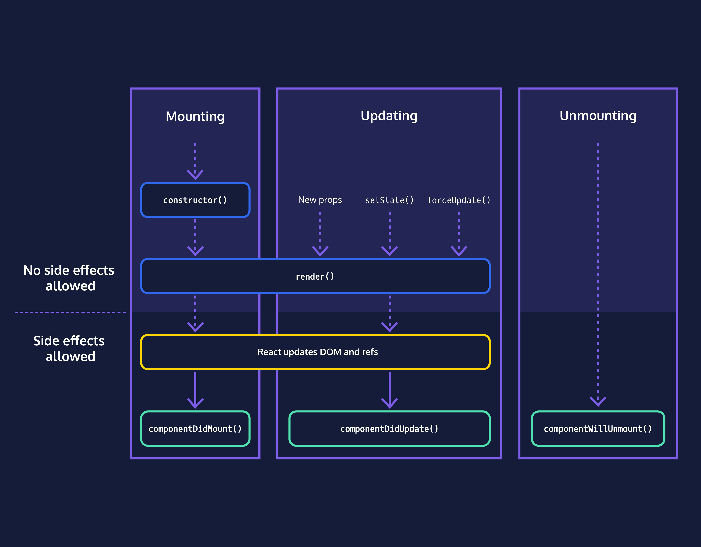

# COMPONENT LIFECYCLE METHODS :

## The Component Lifecycle:

The component lifecycle has three high-level parts:

1. **Mounting**, when the component is being initialized and put into the DOM for the first time

2. **Updating**, when the component updates as a result of changed state or changed props

3. **Unmounting**, when the component is being removed from the DOM



## Introduction to Lifecycle Methods :

+ React components have several methods, called lifecycle methods, that are called at different parts of a component’s lifecycle.

+ `constructor()` is the first method called during the mounting phase. 

+ `render()` is called later during the mounting phase, to render the component for the first time, and during the updating phase, to re-render the component.

+ `constructor()` only executes during the mounting phase, but `render()` executes during both the mounting and updating phase.

`componentDidMount()` is the final method called during the mounting phase. The order is:

1. `The constructor`
2. `render()`
3. `componentDidMount()`

In other words, it’s called after the component is rendered. This is where we’ll want to start our timer.

```javascript
import React from "react";
import ReactDOM from "react-dom";

class Clock extends React.Component {
  constructor(props) {
    super(props);
    this.state = { date: new Date() };
  }
  render() {
    return <div>{this.state.date.toLocaleTimeString()}</div>;
  }
  componentDidMount() {
    // Paste your code here.
    const oneSecond = 1000;
    setInterval(() => {
      this.setState({ date: new Date() });
    }, oneSecond);
  }
}

ReactDOM.render(<Clock />, document.getElementById("app"));

```

## Unmounting Lifecycle Method:

```javascript
 componentWillUnmount(prevProps, prevState) {
    clearInterval(this.interval);
}
```

+ React supports one unmounting lifecycle method, componentWillUnmount, which will be called right before a component is removed from the DOM.

+ `componentWillUnmount()` is used to do any necessary cleanup (canceling any timers or intervals, for example) before the component disappears.

+ Note that the `this.setState()` method should not be called inside `componentWillUnmount()` because the component will not be re-rendered.

## componentDidUpdate :

+ We’ve looked at mounting (constructor(), render(), and componentDidMount()). We’ve looked at unmounting (componentWillUnmount()). Let’s finish by looking at the updating phase.

+ An update is caused by changes to props or state. You’ve already seen this happen a bunch of times.

+ When a component updates, it calls several methods, but only two are commonly used. The first is render(), which we’ve seen in every React component. When a component’s props or state changes, render() is called.

+ The second, which we haven’t seen yet, is componentDidUpdate().

+ Just like componentDidMount() is a good place for mount-phase setup, componentDidUpdate() is a good place for update-phase work.